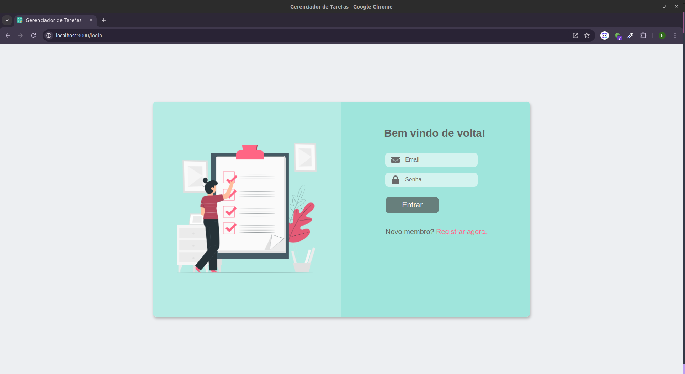
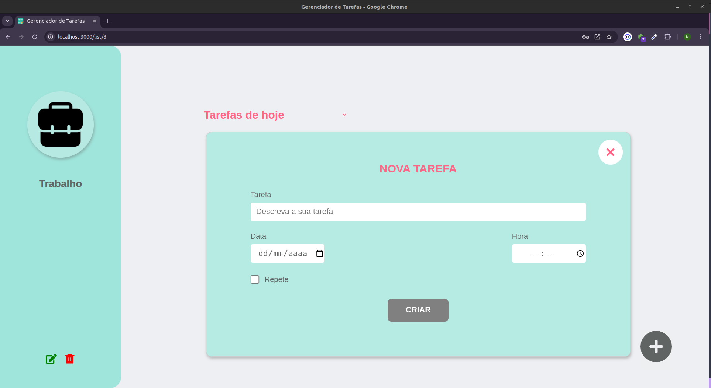
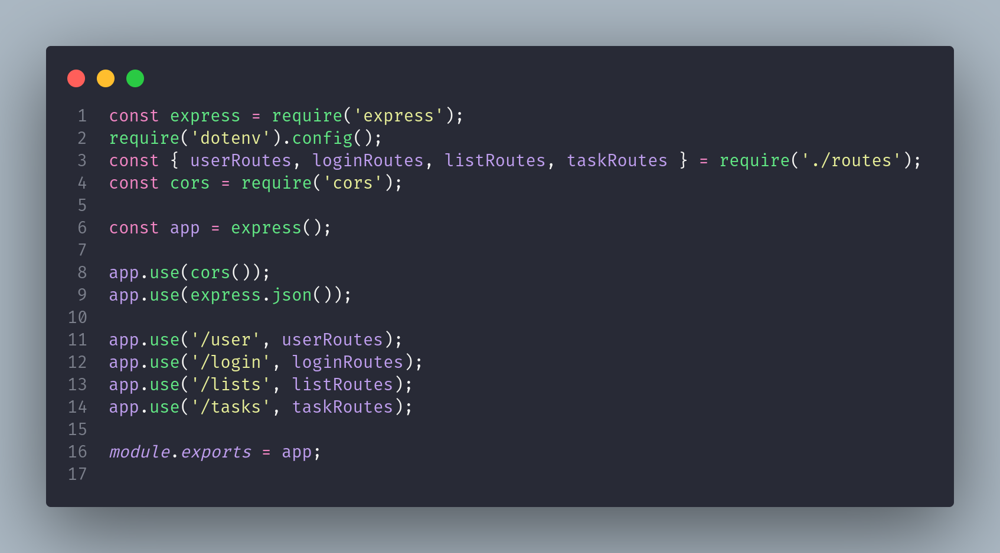

# Gerenciador de tarefas  📝

## Descrição

O gerenciador de tarefas é uma aplicação simples e intuitiva projetada para ajudar os usuários a criar e organizar listas de tarefas. Com ele, os usuários podem facilmente criar listas personalizadas e adicionar tarefas a cada uma delas. O objetivo principal é fornecer uma maneira rápida e eficiente de gerenciar as tarefas diárias, garantindo que nada seja esquecido e que todas as atividades sejam concluídas dentro do prazo. Este projeto é ideal para qualquer pessoa que deseje manter suas tarefas organizadas e acompanhar seu progresso de forma simples e direta.

## Índice

- [Front-end](#🖥️-front-end)
- [Back-end](#👩🏽‍💻-back-end)
- [Feedback e Contato](#feedback-e-contato)

## 🖥️ Front-end

<div style="text-align:center;">
    <div style="margin-bottom: 20px;">
        
        
    </div>
</div>

### Tecnologias Utilizadas:

- **Linguagem de Programação:** JavaScript
- **Framework Front-end:** React.js
- **Ferramenta de Build:** Vite
- **Estilização:** CSS

## Preparando Ambiente

<details>
<summary>💻 Executando localmente</summary>

Certifique-se de ter o Node.js instalado em seu sistema.

Você pode baixá-lo em [Node.js](https://nodejs.org/).

1. Clone o repositório para o seu computador: 
`git@github.com:naiaraxavier/gerenciador-de-tarefas.git`

2. Abra um terminal e navegue até a pasta `frontend` do projeto:
```
cd gerenciador-de-tarefas/frontend
```

3. Instale as dependências do projeto executando o seguinte comando:
```
npm install
```

4. Após a instalação das dependências, inicie o servidor de desenvolvimento local executando:
```
npm run dev
```

5. O servidor de desenvolvimento será iniciado e você poderá acessar o aplicativo em seu navegador acessando 
`http://localhost:3000`.

</details>


<details>
<summary> 🐳 Subindo a aplicação via Docker </summary>

Certifique-se de ter o Docker instalado em seu sistema.

Você pode baixá-lo em [Docker](https://www.docker.com/).

1. Abra um terminal e navegue até a pasta `gerenciador-de-tarefas/`, onde se encontra o arquivo `docker-compose.yml`

```
cd gerenciador-de-tarefas
``` 

2. Execute o seguinte comando para iniciar o aplicativo via Docker Compose:
```
docker-compose up -d
```

3. Aguarde até que o Docker construa a imagem e inicie o contêiner. Após a conclusão, você poderá acessar o aplicativo em seu navegador acessando `http://localhost:3000`

</details>

----
## 👩🏽‍💻 Back-end

<div style="text-align:center;">
    <div style="margin-bottom: 20px;">
        
    </div>
</div>

### Tecnologias Utilizadas:

- **Banco de Dados:** SQL
- **Framework Web:** Express
- **Linguagem de Programação:** Node.js
- **Biblioteca de validação de dados:** Joi
- **Autenticação e autorização:** Jsonwebtoken


## Preparando Ambiente

<details>
<summary>💻 Executando localmente</summary>

Certifique-se de ter o Node instalado em seu sistema.

1. Clone o repositório para o seu computador: 
`git@github.com:naiaraxavier/gerenciador-de-tarefas.git`

2. Abra um terminal e navegue até a pasta `backend` do projeto:
```
cd gerenciador-de-tarefas/backend
```

3. Instale as dependências do projeto executando o seguinte comando:
```
npm install
```

5. Após a instalação das dependências, inicie o servidor de desenvolvimento local executando:
```
npm run dev
```

6. O servidor de desenvolvimento será iniciado e você poderá acessá-lo em: 
`http://127.0.0.1:3001`

</details>

<details>
<summary> 🐳 Subindo a aplicação via Docker </summary>

Em construção🚧 🏗️

</details>

---

## Feedback e Contato

Para enviar feedback ou entrar em contato, por favor, envie um e-mail para `naiaraxf@gmail.com`.

